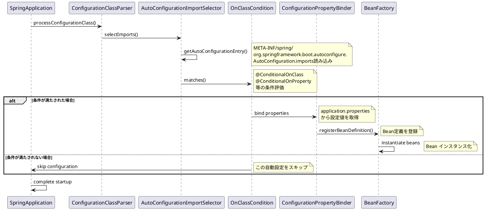

# 第 4 章　自動設定とスターター

（Spring Boot 3.5 系・Java 17+ を前提）

---

## 4‑1　Auto‑configuration の仕組み

### 4‑1‑1　手動設定を“ゼロ”へ近づける発想

従来は **`@Configuration` + XML/JavaConfig** で大量の Bean を宣言していました。Auto‑configuration は *クラスパス* と *環境プロパティ* を調べ、「必要そうな Bean を条件付きで用意する」ことで設定工数を極小化します。 ([docs.spring.io][1])

### 4‑1‑2　検出フロー

1. `@SpringBootApplication` 内の **`@EnableAutoConfiguration`** が起点。
2. **`META-INF/spring/org.springframework.boot.autoconfigure.AutoConfiguration.imports`** が読み取られ、候補クラスが `ImportSelector` でアプリケーションに差し込まれる。
3. Spring コンテナは各候補に付与された **`@Conditional*`** アノテーションを評価し、有効な Bean 定義だけを登録。 ([docs.spring.io][2], [docs.spring.io][1])

> **注意（Boot 3.x）**
> *Boot 2.x まで使用していた `spring.factories` は後方互換用に読まれますが、**新規開発は imports ファイル**を推奨*。 ([github.com][3])

### 4‑1‑3　主要 Conditional 一覧

| 条件                              | 説明             | 典型例                             |
| ------------------------------- | -------------- | ------------------------------- |
| `@ConditionalOnClass`           | 指定クラスがクラスパスにある | JDBC ドライバ検出                     |
| `@ConditionalOnMissingBean`     | 同型 Bean が未定義   | 既定 DataSource                   |
| `@ConditionalOnProperty`        | プロパティ値で ON/OFF | `spring.jpa.open-in-view=false` |
| `@ConditionalOnWebApplication`  | Web アプリの場合のみ   | DispatcherServlet               |
| `@ConditionalOnSingleCandidate` | Bean が 1 個なら利用 | Primary DataSource              |

### 4‑1‑4　順序制御と分割

* **`@AutoConfiguration`**（`@Configuration` の派生）に **`@AutoConfigureBefore/After`** を添えるとロード順を指定できます。
* 大型機能は *モジュール別* に分割し、依存を持たないクラスから先に評価するのが定石。

### 4‑1‑5　挙動の可視化

* Actuator の **`/actuator/conditions`** エンドポイントが *Condition Evaluation Report* を JSON で返し、「どの Auto‑config が採用／却下されたか」を確認できます。 ([docs.spring.io][4])
* 同報告は起動ログにも `CONDITIONS EVALUATION REPORT` として出力でき（`debug=true`）、CI で逸脱を検知可能。

### 4‑1‑6　Auto‑configuration 処理フロー図

以下のシーケンス図は、Spring Boot 起動時の自動設定処理の流れを示しています：



> **図解ポイント**: 各 `@ConditionalOn*` アノテーションが段階的に評価され、条件を満たした場合のみ Bean が登録される仕組みが可視化されています。

---

## 4‑2　スターター依存の設計思想

### 4‑2‑1　スターターとは

> **「やりたいこと」を 1 行で表す依存パッケージ**
> 例：`spring-boot-starter-web` を追加すると、Spring MVC＋Jackson＋Tomcat など *10 以上* のライブラリが適切なバージョンで取り込まれます。 ([geeksforgeeks.org][5], [medium.com][6])

### 4‑2‑2　公式スターターの分類

| カテゴリ          | 代表 Starter                      | 主な用途                       |
| ------------- | ------------------------------- | -------------------------- |
| **Core**      | `spring-boot-starter`           | ロギング (Logback)・YAML 等の最小構成 |
| **Web**       | `*-web` / `*-webflux`           | ブロッキング／リアクティブ HTTP API     |
| **Data**      | `*-data-jpa`, `*-data-redis`    | RDB・NoSQL アクセス             |
| **Messaging** | `*-amqp`, `*-kafka`             | メッセージング基盤                  |
| **Security**  | `*-security`, `*-oauth2-client` | 認証・認可                      |
| **Ops/Test**  | `*-actuator`, `*-test`          | 運用監視・テスティング                |

### 4‑2‑3　スターターが提供する 3 つの価値

1. **BOM によるバージョン一元管理**（`spring-boot-dependencies`）
2. **Auto‑configuration とのリンク** ― スターターを入れる＝関連 Auto‑config が有効化
3. **「除外」も簡単** ― 競合ライブラリがある場合は `<exclusions>` でピンポイント除去

### 4‑2‑4　実務上のベストプラクティス

| シーン                  | 推奨アクション                                                             |
| -------------------- | ------------------------------------------------------------------- |
| Web と WebFlux を併用したい | **どちらか片方だけ** を starter で追加し、もう一方は個別依存にする（Bean 衝突を防止）                |
| ロギング実装を Log4j2 へ変更   | `spring-boot-starter-logging` を除外し `spring-boot-starter-log4j2` を追加 |
| 軽量 CLI ツールを作る        | `spring-boot-starter` + `*-actuator` を外し、JAR サイズを最小化                |

---

## 4‑3　カスタム Auto‑config / Starter 作成

### 4‑3‑1　ユースケース

* 社内共通ライブラリ（監査ログ、SaaS SDK など）を **“依存 1 行”** で導入したい。
* サードパーティー製品の設定テンプレートを共有したい。

### 4‑3‑2　オートコンフィグレーション・モジュール

1. **`myfeature-spring-boot-autoconfigure`** プロジェクトを作成。`spring-boot-autoconfigure` へ `compileOnly` 依存。
2. Bean 定義クラスを作成：

   ```java
   @AutoConfiguration
   @ConditionalOnClass(MyFeatureClient.class)
   @ConditionalOnProperty(prefix = "my.client", name = "enabled", matchIfMissing = true)
   public class MyFeatureAutoConfiguration {

       @Bean
       @ConditionalOnMissingBean
       public MyFeatureClient myFeatureClient(MyFeatureProperties props) {
           return new MyFeatureClient(props.getEndpoint());
       }
   }
   ```
3. `META-INF/spring/org.springframework.boot.autoconfigure.AutoConfiguration.imports` へ FQN を記述：

   ```
   com.example.myfeature.autoconfigure.MyFeatureAutoConfiguration
   ```
4. 2.x 系もサポートしたい場合は `spring.factories` に同じ行を重複登録しておく。 ([docs.spring.io][2], [github.com][3])

### 4‑3‑3　スターター・モジュール

`myfeature-spring-boot-starter` の *pom.xml* は **薄い依存集約体** に徹する。

```xml
<dependencies>
  <!-- Core library -->
  <dependency>
    <groupId>com.example</groupId>
    <artifactId>myfeature-client</artifactId>
  </dependency>

  <!-- Auto‑configuration -->
  <dependency>
    <groupId>com.example</groupId>
    <artifactId>myfeature-spring-boot-autoconfigure</artifactId>
  </dependency>
  
  <!-- Optional: exclude default logging if不要 -->
  <dependency>
    <groupId>org.springframework.boot</groupId>
    <artifactId>spring-boot-starter-logging</artifactId>
    <scope>provided</scope>
  </dependency>
</dependencies>
```

### 4‑3‑4　テスト戦略

*ユニット*：`ApplicationContextRunner` で条件適合／不適合パスを検証。

```java
new ApplicationContextRunner()
  .withConfiguration(AutoConfigurations.of(MyFeatureAutoConfiguration.class))
  .withPropertyValues("my.client.enabled=true")
  .run(ctx -> assertThat(ctx).hasSingleBean(MyFeatureClient.class));
```

*統合*：`@SpringBootTest` でスターター依存を追加しただけのダミーアプリを起動し、エンドポイント疎通を確認。

**カスタムスターター統合テストの実装例**：

```java
@SpringBootTest
@TestPropertySource(properties = {
    "my.feature.endpoint=http://localhost:8080/api",
    "my.feature.enabled=true"
})
class MyFeatureStarterIntegrationTest {

    @Autowired
    private MyFeatureClient myFeatureClient; // 自動設定されたBean

    @Test
    void autoConfigurationShouldProvideClient() {
        // スターターにより自動設定されたクライアントが利用可能であることを検証
        assertThat(myFeatureClient).isNotNull();
        assertThat(myFeatureClient.getEndpoint()).isEqualTo("http://localhost:8080/api");
    }

    @Test  
    @DirtiesContext // Bean定義の汚染を避ける
    void clientShouldBeConditionallyCreated() {
        // 条件に応じてBeanが作成されることを検証
        assertThat(myFeatureClient.isEnabled()).isTrue();
    }
}
```

> **ポイント**: `@SpringBootTest` では実際のアプリケーションコンテキストが起動するため、プロパティバインディングや条件評価を含む完全な自動設定フローをテストできます。

### 4‑3‑5　公開とメンテナンス

| 項目      | 指針                                                   |
| ------- | ---------------------------------------------------- |
| バージョン付番 | **Boot と同じメジャー**（例: `3.5.x`）で揃え、移行負荷を下げる             |
| ドキュメント  | `spring-configuration-metadata.json` を生成し、IDE 補完を有効化 |
| CI      | Boot 新リリースごとに *matrix* テストを走らせ互換性を自動確認               |

---

### まとめ

本章では **Auto‑configuration の内部動作** と **スターター依存の設計哲学** を深掘りし、さらに **自作ライブラリを Boot エコシステムへ統合する手順** を示しました。これらを理解すれば、Spring Boot の *“多すぎる魔法”* を制御しながら、チーム固有のベストプラクティスをコード化できます。次章では MVC／WebFlux を対象に、実際の Web アプリ機能を実装していきましょう。

[1]: https://docs.spring.io/spring-boot/reference/using/auto-configuration.html?utm_source=chatgpt.com "Auto-configuration :: Spring Boot"
[2]: https://docs.spring.io/spring-boot/reference/features/developing-auto-configuration.html?utm_source=chatgpt.com "Creating Your Own Auto-configuration :: Spring Boot"
[3]: https://github.com/spring-projects/spring-boot/wiki/Spring-Boot-3.0-Migration-Guide?utm_source=chatgpt.com "Spring Boot 3.0 Migration Guide - GitHub"
[4]: https://docs.spring.io/spring-boot/api/rest/actuator/conditions.html?utm_source=chatgpt.com "Conditions Evaluation Report (conditions) :: Spring Boot"
[5]: https://www.geeksforgeeks.org/spring-boot-starters/?utm_source=chatgpt.com "Spring Boot - Starters - GeeksforGeeks"
[6]: https://medium.com/%40elouadinouhaila566/spring-boot-starter-dependencies-simplifying-dependency-management-22e4ebcba812?utm_source=chatgpt.com "Spring Boot Starter Dependencies: Simplifying ... - Medium"
